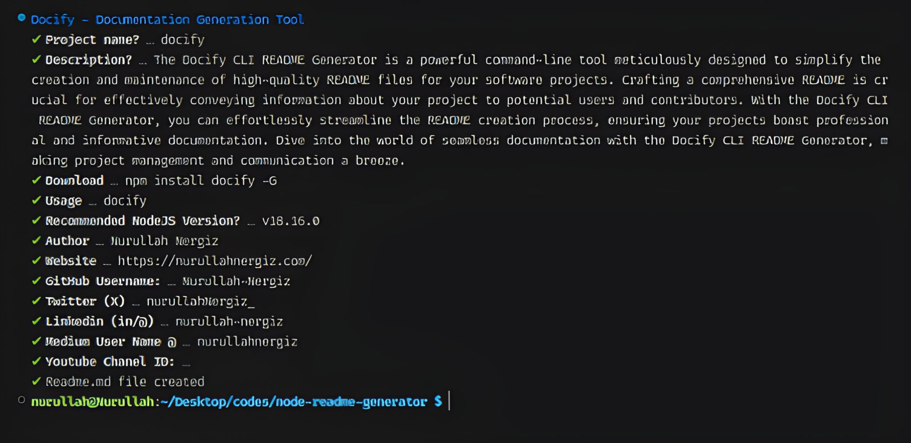

# docify-cli

The Docify CLI README Generator is a powerful command-line tool meticulously designed to simplify the creation and maintenance of high-quality README files for your software projects. Crafting a comprehensive README is crucial for effectively conveying information about your project to potential users and contributors. With the Docify CLI README Generator, you can effortlessly streamline the README creation process, ensuring your projects boast professional and informative documentation. Dive into the world of seamless documentation with the Docify CLI README Generator, making project management and communication a breeze.

---

## Download

```bash
git clone https://github.com/Nurullah-Nergiz/cli-readme-generator
```


media/screenshot.jpeg

Recommended NodeJS Version [v21.2.0](https://nodejs.org/dist/v21.2.0)

## Dependencies

    chalk: ^5.3.0
    ora: ^7.0.1
    prompts: ^2.4.2

## Dependencies

    @types/node: ^20.6.0
    @types/prompts: ^2.4.9

---

## Author

-  Nurullah Nergiz

-  [](https://www.github.com/Nurullah-Nergiz)

## License

docify-cli is licensed under the MIT License. See the [LICENSE](LICENSE) file for more information.

---

This project was generated with [Docify-Cli](https://www.npmjs.com/package/docify-cli).
